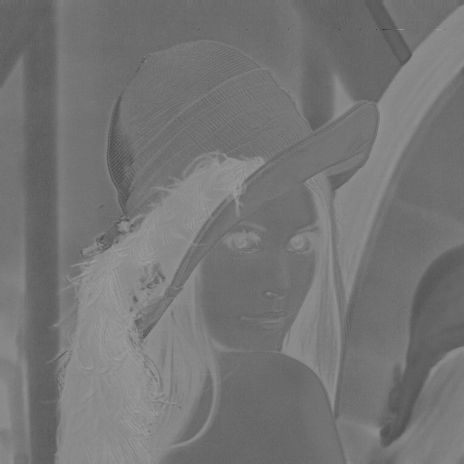

# Requirements
python=3.9.13

Pillow=11.3.0 

numpy=2.0.2

# Run
*     python main.py

# Result

| R | G | B | Y |
|:---:|:---:|:---:|:---:|
|  |  |  |  |

| U | V | Cb | Cr |
|:---:|:---:|:---:|:---:|
|  |  |  |  |