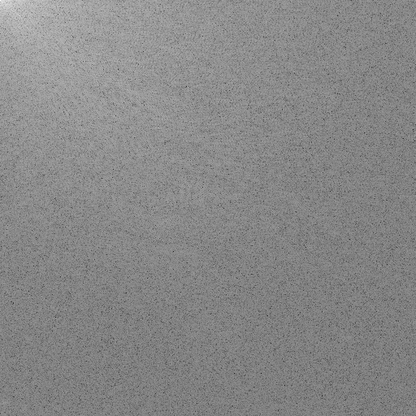
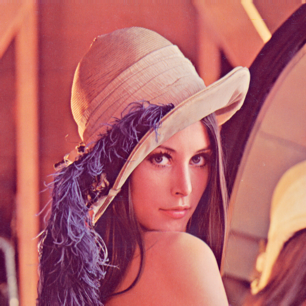

# Requirements
python=3.9.13

matplotlib==3.9.4

numpy==2.0.2

opencv-python==4.12.0.88

Numba==0.60.0

# Download requiremetns
*     pip install -r requirements.txt

# Run
*     python main.py

# Result

| 2D-DCT | 1D-DCT |
|:---:|:---:|
|  |  |

| original | gray | Reconstructed |
|:---:|:---:|:---:|
|  |  |  |